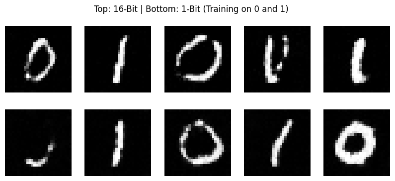

# Structural Dominance in 1-Bit Diffusion Models

**An empirical investigation into the geometric interpolation regimes of binary-weight diffusion priors.**


*(Top: 16-Bit Control | Bottom: 1-Bit Experimental. Note the structural stability of the 1-bit generations.)*

## Abstract
Current research in model quantization focuses largely on Large Language Models (LLMs). This project investigates the limits of quantization in **Diffusion Models**, specifically testing whether a ResNet-based diffusion architecture can learn complex topological manifolds (handwritten digits '0' and '1') using only **1-bit weights** ($\{-1, 1\}$).

Contrary to the assumption that extreme quantization leads to mode collapse or signal degradation, our experiments demonstrate that **1-bit models prioritize structural information over texture**, leading to superior generalization scores and distinct geometric interpolation behaviors.

## Key Findings

### 1. Generalization vs. Memorization
We compared a standard **16-Bit (Float16) ResUNet** against a custom **1-Bit (Binary) ResUNet** trained on the MNIST dataset (Classes 0 & 1). Quantitative evaluation using Euclidean distance in pixel space reveals:

| Metric | 16-Bit Control | 1-Bit Experimental | Interpretation |
| :--- | :--- | :--- | :--- |
| **Memorization Score**<br>*(Avg Dist to Nearest Neighbor)* | `3.3900` | **`4.0672`** | Higher is better. The 1-bit model copies *less* from the training set. |
| **Diversity Score**<br>*(Avg Intra-Sample Dist)* | `7.8835` | **`8.1373`** | Higher is better. The 1-bit model explores the latent space more aggressively. |

**Conclusion:** The 1-bit model is not "rote memorizing." Its limited capacity acts as a strong regularizer, forcing it to hallucinate novel structural variations rather than overfitting to training noise.

### 2. The "Explosion" vs. "Curling" Phenomenon
High-resolution latent walks (120 frames) between class '1' and class '0' revealed a fundamental difference in how the models interpolate concepts:

* **16-Bit Behavior ("Explosion"):** Relying on intensity interpolation. The vertical line of the '1' dissolves or fragments while the '0' fades in.
* **1-Bit Behavior ("Curling"):** Relying on geometric interpolation. The model preserves the "solid" nature of the digit, physically bending and curling the edges of the '1' until they meet to form a '0'.

This suggests that 1-bit weights force the model to treat objects as **topologically cohesive entities** rather than independent pixel intensities.

## Architecture
The model uses a custom `BitResUNet` architecture:
* **Weights:** Centralized and binarized to $\{-1, 1\}$ during the forward pass using the Straight-Through Estimator (STE).
* **Backbone:** Residual Blocks with Group Normalization and SiLU activation.
* **Precision:** Skip connections and activations remain in high precision to allow gradient flow, while the "brain" (convolutional weights) is strictly binary.

## Usage

### 1. Installation
```bash
pip install torch torchvision scipy matplotlib tqdm
```
### 2. Run the Experiment
To train both models (Control vs Experimental) and generate the quantitative report:

```bash

python train_and_eval_both.py
```

### 📁 Files
`train_and_eval_both.py`: The core scientific script. Trains both architectures, generates samples, and computes the rigorous distance metrics.

`checkpoints/`: Contains the trained weights (`.pth`).

`results/`: Visual evidence of the latent space traversal.

### 📜 Citation & License
This project is open-source research. If you find the "Curling vs Explosion" insight useful for your own quantization work, please credit this repository.
